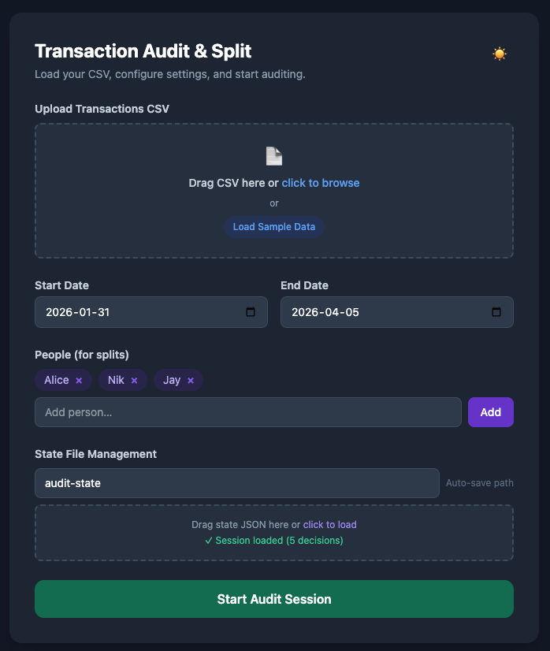
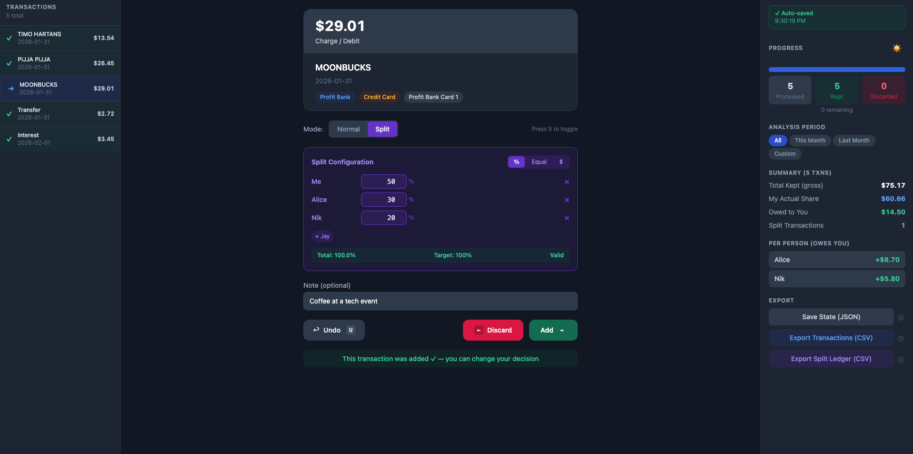

# 🧾 SplitCraft

[](https://github.com/gauravrai1/SplitCraft/actions/workflows/test.yml)


A local-first web application for auditing transactions, classifying expenses, and splitting costs across people.

## 📸 Screenshots

### Start Screen



### Auditing Screen



## 📁 Folder Structure

```
├── media/
│   ├── start_screen.png          # App start screen screenshot
│   └── auditing_screen.png       # App auditing screen screenshot
├── config/
│   └── default.json              # Configuration (people, splits, date filters)
├── input/
│   └── transactions.csv          # Your transaction CSV file(s)
├── output/
│   ├── audit-state.json          # Auto-saved session state
│   ├── processed-transactions.csv # Exported audit results
│   └── split-ledger.csv          # Split breakdown by person
├── server.html        # Main application
├── server.js                      # Simple Node.js server
└── README.md                      # This file
```

## 🚀 Getting Started

### Option 1: With Node.js Server (Recommended)

The server provides better file handling and auto-loading of configuration.

**Requirements:**
- Node.js 14+ — download from [nodejs.org](https://nodejs.org) if not installed (`node --version` to check)

**Steps:**

```bash
# 1. Navigate to the project folder
cd /path/to/SplitCraft

# 2. (Optional) Edit config/default.json to set your people list and date filters

# 3. Add your CSV file to the input/ folder and update sampleDataFile in config

# 4. Start the server
npm start
# or: node server.js

# 5. Open browser
# Visit: http://localhost:3000
```

**What the server does:**
- Serves the HTML application
- Loads config from `config/default.json`
- Provides "Load Sample Data" button
- Auto-saves state to `output/`
- Handles exports

### Option 2: Standalone (No Server)

You can open `server.html` directly in your browser, but you'll need to:
- Manually upload CSV files (no sample data loading)
- Manually manage state files
- Use localStorage for session persistence

## ⚙️ Configuration

Edit `config/default.json` to customize:

```json
{
  "appName": "Transaction Audit & Split",
  "defaultSplit": {
    "type": "percentage",
    "participants": [
      { "name": "Me", "value": 50 },
      { "name": "Alice", "value": 50 }
    ]
  },
  "people": ["Alice", "Bob", "Charlie"],
  "filters": {
    "startDate": "2025-01-01",
    "endDate": "2025-12-31"
  }
}
```

**Fields:**
- `defaultSplit` - Default split configuration for new audits
- `people` - List of people available for splitting
- `filters` - Default date range for filtering transactions

**Folder conventions (fixed, no config needed):**
- `input/sample.csv` — loaded by "Load Sample Data" button
- `output/audit-state.json` — auto-saved session state
- `output/` — all CSV exports

## 📥 Input Data

Add CSV files to the `input/` folder. Format required:

```csv
Date,Description,Amount,Institution,Account_Type,Account_Name
2026-01-31,Groceries,50.00,Bank,Chequing,Main Account
2026-02-01,Restaurant,-35.50,Bank,Credit Card,Visa
```

**Required columns:**
- `Date` - YYYY-MM-DD format
- `Description` - Transaction description
- `Amount` - Positive (expense) or negative (payment/credit)
- `Institution` - Bank/service name
- `Account_Type` - Chequing or Credit Card
- `Account_Name` - Specific account name

### Using an LLM to Standardize Input CSVs

If you use an LLM to convert bank exports or statement data into this CSV schema, read [LLM_STANDARDIZATION_GUIDE.md](./LLM_STANDARDIZATION_GUIDE.md) first.

Important:
- SplitCraft itself runs locally, but any external LLM tool may store, log, or process your data outside your machine.
- Redact all PII and sensitive financial identifiers before sending data to any LLM.
- Review the generated CSV manually before importing it.

## 📤 Outputs

All exports are saved to the `output/` folder:

### 1. **processed-transactions.csv**
Audited transactions with your decisions:
```csv
id,date,description,amount,institution,account_type,account_name,status,is_split,note
```

### 2. **split-ledger.csv**
Who owes whom breakdown:
```csv
transaction_id,person,amount
```

### 3. **audit-state.json**
Session state (auto-saved every 500ms):
```json
{
  "currentIndex": 42,
  "transactions": [...]
}
```

## 🎮 Usage

### 1. **Start Session**
- Click "Start Audit Session"
- Optionally load previous state from JSON file
- Or load sample data with "Load Sample Data" button

### 2. **Process Transactions**
- Keyboard shortcuts:
  - `→` (Right) - Keep transaction
  - `←` (Left) - Discard transaction
  - `U` - Undo last action
  - `S` - Toggle split mode

### 3. **Split Expenses** (Optional)
- Toggle "Split" mode for any transaction
- Choose split type:
  - **%** (Percentage) - Everyone gets a percentage
  - **Equal** - Split evenly
  - **$** (Absolute) - Specific amounts
- Add/remove participants
- Validation ensures amounts add up

### 4. **Add Notes**
- Note why you kept or discarded transactions
- Useful for reconciliation later

### 5. **Export Results**
- **Save State** - Download session for later
- **Export Transactions** - CSV with all audited transactions
- **Export Split Ledger** - Who owes whom breakdown

## 🌓 Dark Mode

- Automatically detects system preference
- Click 🌙/☀️ button to toggle
- Choice persists in browser

## 💾 State Persistence

### Auto-Save (Server Mode)
- State saved to `output/audit-state.json` every 500ms
- Survives browser refresh
- Can be backed up or shared

### Browser Storage (Standalone Mode)
- State saved to localStorage (browser memory)
- Persists across sessions
- Limited by browser storage quota
- Lost if browser data is cleared

## 🔐 Privacy

- ✅ All processing happens locally (no cloud)
- ✅ No data sent to external servers
- ✅ Works offline (except initial app load)
- ✅ Your financial data stays on your machine

If you choose to use a third-party LLM to prepare your CSV, that privacy model changes. See [LLM_STANDARDIZATION_GUIDE.md](./LLM_STANDARDIZATION_GUIDE.md) for the recommended redaction and review workflow.

## 🐛 Troubleshooting

### "Load Sample Data" button doesn't work
- Make sure you're running the Node.js server (`npm start`)
- Check that the CSV file named in `config/default.json → sampleDataFile` exists in the `input/` folder
- Try refreshing the page

### Exports not saving
- Check that `output/` folder exists and is writable
- Verify server is running (if using server mode)
- Manually download exports from right panel button

### State not persisting
- Ensure localStorage is enabled in browser settings
- Or use the "Save State" button to download manually

## 📋 Requirements

- **Browser**: Chrome, Firefox, Safari, Edge (any modern browser)
- **Node.js**: 14+ (only for server mode)
- **Disk Space**: < 1MB for app + data

## 🎯 Features

- ✅ Drag-and-drop CSV upload
- ✅ Transaction classification (Keep/Discard)
- ✅ Flexible expense splitting (%, equal, absolute)
- ✅ Auto-save session state
- ✅ Dark mode
- ✅ Per-person balance calculation
- ✅ CSV exports for analysis
- ✅ Full history and undo
- ✅ Resumable sessions
- ✅ Zero data loss

## 📝 License

Open source. Use freely for personal or organizational use.

## 🤝 Support

For issues or questions, check the transaction data format and ensure all required columns are present in your CSV.

---

**Version**: 1.0
**Last Updated**: April 2026
